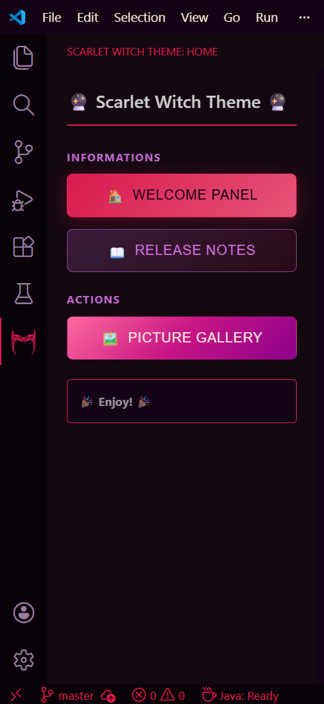
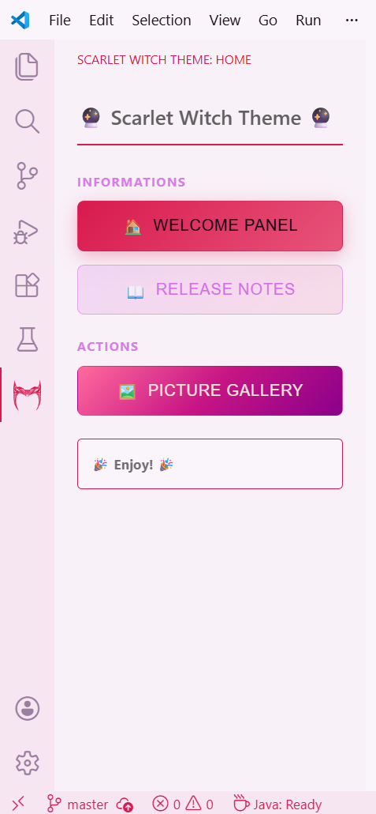
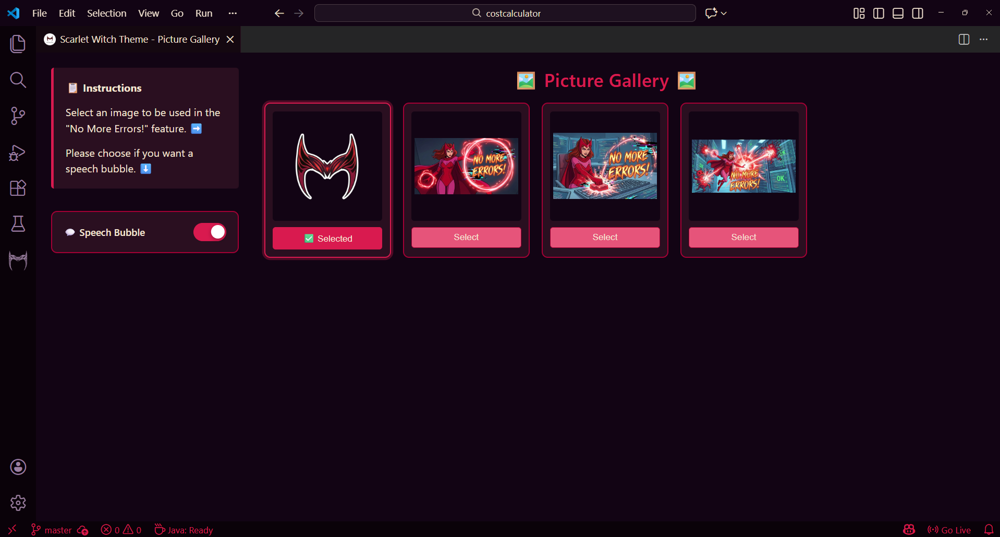
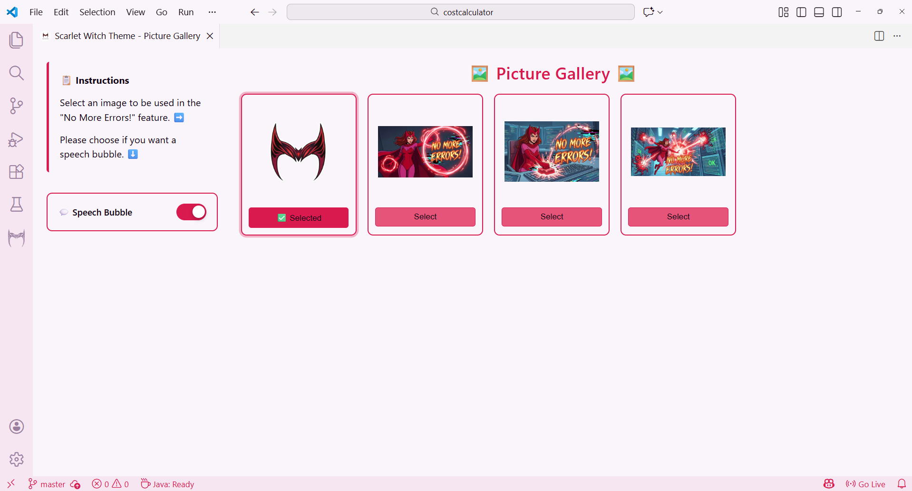

# 🔮 Scarlet Witch Theme 🔮

| English | Magyar |
|---------|--------|
| **A fan-made VS Code theme inspired by Scarlet Witch.** Immerse yourself in the chaos magic with a dark or light, visually stunning color palette designed for comfortable long coding sessions. | **Ez egy fan-made VS Code-téma, amit a Skarlát Boszorkány ihletett.** Merülj el a káoszmágia világában ezzel a sötét vagy világos színvilággal, amely hosszú kódolási munkákhoz is kényelmes vizuális élményt nyújt. |

## ✨ Features / Funkciók ✨

| English | Magyar |
|---------|--------|
| - Scarlet Witch inspired color palette | - Skarlát Boszorkány ihlette színpaletta |
| - Perfect contrast for code syntax | - Tökéletes kontrasztok |
| - Release notes | - Frissítés jegyzék |
| - Activity Bar and SideBar | - Tevékenység sáv és Oldalsáv |
| - Status Bar button that fixes an error in a given file with Copilot | - Állapotsor gomb ami hibát javít az adott fájlban Copilottal |
| - Picture Gallery for selecting an image to Magic Panel  | - Képgaléria egy kép kiválasztásához a Magic Panel-hez |
| **🔜 More features to come!** | **🔜 Még több funkció hamarosan!** |

## 🚀 Getting Started /  Kezdő lépések 🚀

| English | Magyar |
|---------|--------|
| 1. **Install** the extension from the VS Code Marketplace 2. **Activate** the theme: `File → Preferences → Themes → Color Theme → Scarlet Witch (Dark) / Scarlet Witch (Light)` 3. **Enjoy** the magical coding experience! ✨ | 1. **Telepítsd** a bővítményt a VS Code Marketplace-ről 2. **Aktiváld** a témát: `File → Preferences → Themes → Color Theme → Scarlet Witch (Dark) / Scarlet Witch (Light)` 3. **Élvezd** a varázslatos kódolási élményt! ✨ |

---

## 📸 Screenshots /  Képernyőképek 📸

### Extension preview panel / Bővítmény előnézeti panelje

### In use / Gyakorlatban

### Activity Bar & Sidebar / Tevékenység sáv és Oldalsáv

### Picture Gallery / Képgaléria

### No More Errors! panel

---

## ⚠️ Important /  Fontos ⚠️

| English | Magyar |
|---------|--------|
| This is a **fan-made** project. | Ez egy **rajongói projekt**. |
| Created for personal use purposes. 🆓| Személyes használatra készült. 🆓 |
| Artificial Intelligence generated images. 🤖 | Mesterséges Intelligencia által generált képek. 🤖 |
| Using the Status Bar button reduces Copilot chat volume. ⬇️ | Állapotsor gombbal a Copilot üzenet mennyiségét használja. ⬇️|